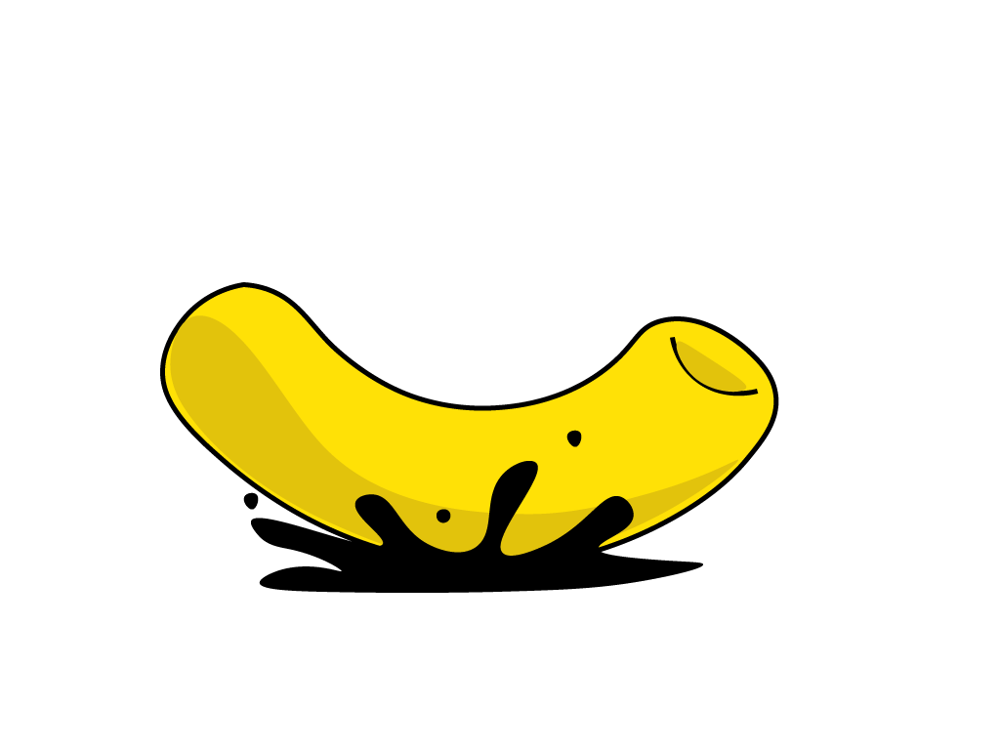

# 2017_IMY320_Macaroni Ink

IMY 320 Group Project aimed to developing a website that promotes a game that's currently being developed.

# Team
1. Keoagile Dinake - 15041744
2. Joe Malope - 15221777
3. Khodani Mufamadi - 14197520
---
# Overview
This document aims to provide a formal design proposal of Macaroni Ink by explaining the objectives, specifications, design concepts, target audience, and project management of our game (Heart of Toria) as well was convey the look and feel of the website. Macaroni Ink  was developed by Joe Malope, and intended for the following purposes.

# Game Narrative
One day there was virus that hit the earth and changed mankind as we know it. All the old cultures,traditions and ideas that we believed to be our reality was reduced to a single term “ Old Earth” Before the dust settled a new regime was born and it proceeded to take the Earth and remains of the Earth and it kept the spirits of man down.
After years of planning and preparation, a broken man haunted by memories of the Old Earth and unanswered questions? Sets out to go to the Heart of Toria and tries to save the world after receiving actionable intelligence about the base location of the regime that ascended as the Old Earth fell to the ashes.With the Heart of Toria being rumored to be impenetrable to normal men.Our noble hero chased whispers of a man, who is said to have built the impenetrable walls of Toria a hacker time once knew as Phase to enlist
alongside noble soldiers in his strike at the Heart of Toria.
For the purposes of planning out our game(Heart of Toria) we planned on using our website as a way of walking the audience through the narrative of the game through the use of cleverly animated imagery and reinforcing text. As the player scrolls down he will notice a transition between the mood(conveyed using colour and images) of the site from one end of the spectrum to another. The transition represents the change between Old Earth and New Earth.

# Design Objectives
The main objective of the design is to convey the theme of our game to allow us to help guide the expectations of our audience through the use of the following:
1. Achieving a good level of UX
2. Usability

## Achieving a good level of UX
The reason this is significant is that UX can influence how the users perceive a website.If a user has a terrible user experience it will be more difficult for them to get what the user is trying to convey, where as if the website’s was layout is cluttered and no mechanisms, was used to. We will attempt to create a visual hierarchy using colour ,spacing to guide the audience.

## Usability
Ties together with good UX we hope our game website will not only be visually appealing but also but the usable for our user he/she can also intuitively follow the narrative of the show.

# Technical Specifications
Several design aspects were taken into account, and in the following subsections we will discuss each such design aspect, and its importance to the promotion of the game.
## Onscroll Parallax
For the website we planned on familiarising the user with storyline of the game by using an onscroll parallax technique which is meant to mimic and improve on the same flow one would experience while going through an everyday storyboard. This is done using scrolling as a mechanism to allow the users to move forward and reverse of through the storyline, controlling which part of the narrative the user see’s at one point in time.
This motivation behind the use of parallax in our design was to tell the narrative of the game by using emotive images and captions that convey the storyline of the game. This is intended to give the audience a clear overview of the game without overcrowding them with texts, and thus allowing a natural flow of information intake.

# Milestones
## Initial Concept
Iterate through several brainstorming sessions to identify design objectives, and key features to be conveyed by the promotional website. Finally, concretising the design elements, objectives and key features of the website.
## Prototyping
After the first attempt to concretizing the design we will enter the prototyping phase This step we will attempt to create rough low fidelity prototypes of our designs to try and get a feel of how the final product will look. We also use those prototypes to evaluate how intuitive the design is through small UX tests will a small sample space.
## User Experience
User experience is very significant at this stage because it will help us correctly communicate the whole idea and narrative of the game as well create and invoke interest and hype around the game. This will involve gathering information from our sample space about the how the found the website in terms of usability and improve based on the research gathered.
## Testing
The objective here is to ensure the essence of the game is conveyed through the user experience. This entails that we perform several usability tests and design refinements to ensure will a level of confidence that the website is not overloaded with text and unnecessary interactive mechanisms that can distract the audience from the intended purpose of the website.
## Deployment
At this stage the website has been through multiple cycles of usability testing and  various design and development refinements. Thus, the webiste is a viable promotional tool that accurately captures the essence of the game and is ready to be published.
___
# References
1. Neil Tortorella, 2004, Crafting the Perfect Design Proposal, viewed 15 August 2017, http://www.graphics.com/article-old/crafting-perfect-design-proposal.
2. Nick Babich, 2017, Do’s and Don’ts of Web Design, viewed 18 August 2017, https://uxplanet.org/dos-and-don-ts-of-web-design-8c9d6a5de7c6.
3. Preece, J., Rogers, Y. & Sharp, H., 2002, Interaction Design: Beyond Human-Computer Interaction, Wiley J.
---
# https://kmdinake.github.io/2017_IMY320_Macaroni/
